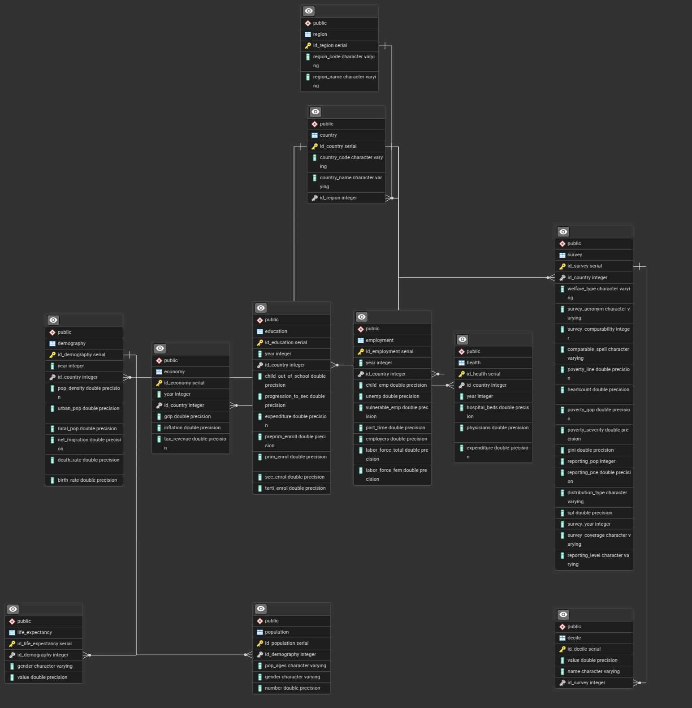

# Projeto de Banco de Dados: Pobreza, Desigualdade e Indicadores Sociais Globais
  
## Descrição do Projeto

Este projeto integra dados de dois conjuntos de dados (datasets) relacionados a:
- [Pobreza e desigualdade global](https://pip.worldbank.org/poverty-calculator)
- [Indicadores de educação, trabalho, demografia, saúde e economia dos países](https://datacatalog.worldbank.org/search/dataset/0037712/World-Development-Indicators)

O banco de dados foi desenvolvido para armazenar, organizar e permitir consultas significativas sobre a situação social e econômica dos países, com foco em temas diretamente conectados aos **Objetivos de Desenvolvimento Sustentável (ODS)** da ONU.

---

## Objetivos de Desenvolvimento Sustentável Relacionados
Os dados e consultas abordam temas conectados aos seguintes ODS:
- ODS 1: Erradicação da Pobreza
- ODS 3: Saúde e Bem-Estar
- ODS 4: Educação de Qualidade
- ODS 10: Redução das Desigualdades  

---

### 1. Modelo Conceitual

- Desenvolvemos o diagrama entidade-relacionamento (DER) representando as principais entidades (como País, Indicador, Pobreza, Educação, Saúde, etc.) e seus relacionamentos.
- Para isso filtramos os datasets escolhidos pelo código identificador dos indicadores, separando cada um deles em entidades. Além disso atribuimos nomes melhores para cada indicador, a fim de facilitar a consulta SQL.
- Abaixo temos os indicadores escolhidos de cada dataset separado em suas entidades. Vale lembrar que a tabela abaixo tem apenas a parte dos indicadores, sendo que cada informação dessa possui seu país/região e ano de origem da pesquisa.
- Foi feita normalização nas entidades _Population_ e _Life Expectancy_, para separar dados em tabelas menores para reduzir redundância e dependências indesejadas. Portanto, nossa estruturação utiliza a 1FN (Primeira Forma Normal) e 3FN (Terceira Forma Normal)

#### [Global Indicators](https://github.com/FernandoRST7/Postgres-Database-Project-PovertyStudy/blob/main/processing/global_indicators/Global_Indicators_filtered.csv)

| INDICATOR                                                                   | INDICATOR CODE    | STRONG ENTITY / WEAK ENTITY |      ATTRIBUTE NAME      |
| --------------------------------------------------------------------------- | ----------------- | --------------------------- | :----------------------: |
| **DEMOGRAPHY**                                                              |                   |                             |                          |
| Population ages 0-14, female                                                | SP.POP.0014.FE.IN | Demography/Population       | pop_ages, gender, number |
| Population ages 0-14, male                                                  | SP.POP.0014.MA.IN | Demography/Population       |            -             |
| Population ages 15-64, female                                               | SP.POP.1564.FE.IN | Demography/Population       |            -             |
| Population ages 15-64, male                                                 | SP.POP.1564.MA.IN | Demography/Population       |            -             |
| Population ages 65 and above, female                                        | SP.POP.65UP.FE.IN | Demography/Population       |            -             |
| Population ages 65 and above, male                                          | SP.POP.65UP.MA.IN | Demography/Population       |            -             |
| Population density (people per sq. km of land area)                         | EN.POP.DNST       | Demography                  |       pop_density        |
| Urban population                                                            | SP.URB.TOTL       | Demography                  |        urban_pop         |
| Rural population                                                            | SP.RUR.TOTL       | Demography                  |        rural_pop         |
| Net migration                                                               | SM.POP.NETM       | Demography                  |      net_migration       |
| Death rate, crude (per 1,000 people)                                        | SP.DYN.CDRT.IN    | Demography                  |        death_rate        |
| Birth rate, crude (per 1,000 people)                                        | SP.DYN.CBRT.IN    | Demography                  |        birth_rate        |
| Life expectancy at birth, female (years)                                    | SP.DYN.LE00.FE.IN | Demography/Life Expectancy  |      gender, value       |
| Life expectancy at birth, male (years)                                      | SP.DYN.LE00.MA.IN | Demography/Life Expectancy  |            -             |
|                                                                             |                   |                             |                          |
| **EMPLOYMENT**                                                              |                   |                             |                          |
| Children in employment, total (% of children ages 7-14)                     | SL.TLF.0714.ZS    | Employment                  |        child_emp         |
| Unemployment, total (% of total labor force) (national estimate)            | SL.UEM.TOTL.NE.ZS | Employment                  |          unemp           |
| Vulnerable employment, total (% of total employment) (modeled ILO estimate) | SL.EMP.VULN.ZS    | Employment                  |      vulnerable_emp      |
| Part time employment, total (% of total employment)                         | SL.TLF.PART.ZS    | Employment                  |        part_time         |
| Employers, total (% of total employment) (modeled ILO estimate)             | SL.EMP.MPYR.ZS    | Employment                  |        employers         |
| Labor force, total                                                          | SL.TLF.TOTL.IN    | Employment                  |    labor_force_total     |
| Labor force, female (% of total labor force)                                | SL.TLF.TOTL.FE.ZS | Employment                  |     labor_force_fem      |
|                                                                             |                   |                             |                          |
| **EDUCATION**                                                               |                   |                             |                          |
| Children out of school, primary                                             | SE.PRM.UNER       | Education                   |   child_out_of_school    |
| Progression to secondary school (%)                                         | SE.SEC.PROG.ZS    | Education                   |    progression_to_sec    |
| Government expenditure on education, total (% of GDP)                       | SE.XPD.TOTL.GD.ZS | Education                   |       expenditure        |
| School enrollment, preprimary (% gross)                                     | SE.PRE.ENRR       | Education                   |      preprim_enrol       |
| School enrollment, primary (% gross)                                        | SE.PRM.ENRR       | Education                   |        prim_enrol        |
| School enrollment, secondary (% gross)                                      | SE.SEC.ENRR       | Education                   |        sec_enrol         |
| School enrollment, tertiary (% gross)                                       | SE.TER.ENRR       | Education                   |       terti_enrol        |
|                                                                             |                   |                             |                          |
| **HEALTH**                                                                  |                   |                             |                          |
| Hospital beds (per 1,000 people)                                            | SH.MED.BEDS.ZS    | Health                      |      hospital_beds       |
| Physicians (per 1,000 people)                                               | SH.MED.PHYS.ZS    | Health                      |        physicians        |
| Current health expenditure (% of GDP)                                       | SH.XPD.CHEX.GD.ZS | Health                      |       expenditure        |
|                                                                             |                   |                             |                          |
| **ECONOMY**                                                                 |                   |                             |                          |
| GDP (current US$)                                                           | NY.GDP.MKTP.CD    | Economy                     |           gdp            |
| Inflation, GDP deflator (annual %)                                          | NY.GDP.DEFL.KD.ZG | Economy                     |        inflation         |
| Tax revenue (% of GDP)                                                      | GC.TAX.TOTL.GD.ZS | Economy                     |       tax_revenue        |
#### [Poverty_Inequality](https://github.com/FernandoRST7/Postgres-Database-Project-PovertyStudy/blob/main/processing/poverty_inequality/Poverty_Inequality_filtered.csv)

| Description                                                        | Field             |
| ------------------------------------------------------------------ | ----------------- |
| **SURVEY**                                                         |                   |
| Research institution acronym.                                      | survey_acronym    |
| Geographic/demographic coverage (e.g., urban, rural).              | survey_coverage   |
| Data aggregation level (e.g., national, regional).                 | reporting_level   |
| Welfare metric (income or consumption).                            | welfare_type      |
| Notes on comparability with other surveys.                         | comparability     |
| Time period for temporal comparisons.                              | comparable_spell  |
| Monetary poverty threshold (in USD).                               | poverty_line      |
| % of population below the poverty line.                            | headcount         |
| Average income shortfall of the poor relative to the poverty line. | poverty_gap       |
| Inequality among the poor (weights those furthest from the line).  | poverty_severity  |
| Gini coefficient (0 = perfect equality, 1 = maximum inequality).   | gini              |
| Total population covered in the survey.                            | reporting_pop     |
| Reported per capita consumption expenditure.                       | reporting_pce     |
| Data distribution method (e.g., nominal, adjusted).                | distribution_type |
| Secondary/specific poverty line (if applicable).                   | spl               |
|                                                                    |                   |
| **DECILE**                                                         |                   |
| Decile position ("Decile 1" to "Decile 10")                        | name              |
| % of population in the given decile.                               | value             |


### 2. Modelo Relacional

- Foi feita a transformação do modelo conceitual para o modelo relacional, especificando tabelas, atributos, chaves primárias e estrangeiras.
- Desta forma foi possível conseguir 



### 3. Modelo Físico

A partir do modelo relacional feito no ERD do pgAdmin, foi gerado o modelo físico do banco de dados, pronto para ser executado em um servidor PostgreSQL.

O script de criação (DDL) do banco de dados foi escrito em SQL padrão e inclui:
- Criação de tabelas
- Definição de chaves primárias e estrangeiras
- Restrições de integridade

Este modelo pode ser encontrado [aqui](models/Physical_model.sql).

### 4. Popular Banco de Dados

Para popular o banco de dados, criamos várias tabelas, uma para cada entidade do Banco de Dados. Os códigos para criação das entidades podem ser encontradas aqui([Global Indicators](processing/global_indicators/Global_Indicators_entity.py) e [Poverty and Inequality](processing/poverty_inequality/Poverty_Inequality_entity.py))

### 5. Consultas SQL

Elaboramos as seguintes consultas SQL avançadas, que integram dados de várias tabelas, utilizam agrupamentos, ordenações, operações de junção e funções analíticas para explorar correlações significativas entre os dados:

#### 1. Análise de Desemprego, Desigualdade e Educação por País
Consulta que relaciona a taxa de desemprego, o coeficiente de Gini e a taxa de matrícula no ensino secundário para avaliar como a educação pode influenciar a desigualdade e o desemprego em diferentes países.
```sql
SELECT 
    c.country_name,
    e.unemp AS unemployment_rate,
    p.gini AS gini_coefficient,
    ed.sec_enrol AS secondary_enrollment_rate,
    CASE 
        WHEN ed.sec_enrol > 80 THEN 'High Enrollment'
        WHEN ed.sec_enrol BETWEEN 50 AND 80 THEN 'Moderate Enrollment'
        ELSE 'Low Enrollment'
    END AS enrollment_category,
    RANK() OVER (PARTITION BY c.region ORDER BY p.gini DESC) AS inequality_rank
FROM 
    Employment e
JOIN 
    Country c ON e.country_id = c.country_id
JOIN 
    Poverty p ON c.country_id = p.country_id
JOIN 
    Education ed ON c.country_id = ed.country_id AND e.year = ed.year AND p.year = ed.year
WHERE 
    e.year = p.year
    AND ed.sec_enrol IS NOT NULL
    AND p.gini IS NOT NULL
ORDER BY 
    inequality_rank, unemployment_rate DESC, secondary_enrollment_rate DESC;
```

#### 2. Expectativa de Vida, Despesas com Saúde e Taxa de Mortalidade
Consulta que analisa a relação entre a expectativa de vida, os gastos com saúde como percentual do PIB e a taxa de mortalidade, destacando países com altos gastos em saúde, mas baixa expectativa de vida.
```sql
SELECT 
    c.country_name,
    l.gender,
    l.value AS life_expectancy,
    h.expenditure AS health_expenditure,
    d.death_rate AS crude_death_rate,
    NTILE(4) OVER (ORDER BY h.expenditure DESC) AS health_expenditure_quartile,
    ROUND((l.value / h.expenditure), 2) AS life_expectancy_per_expenditure
FROM 
    Life_Expectancy l
JOIN 
    Country c ON l.country_id = c.country_id
JOIN 
    Health h ON c.country_id = h.country_id AND l.year = h.year
JOIN 
    Demography d ON c.country_id = d.country_id AND l.year = d.year
WHERE 
    l.year = h.year
    AND l.value IS NOT NULL
    AND h.expenditure IS NOT NULL
    AND d.death_rate IS NOT NULL
ORDER BY 
    health_expenditure_quartile, life_expectancy_per_expenditure DESC, crude_death_rate ASC;
```

#### 3. População Urbana, PIB e Taxa de Migração
Consulta que verifica a relação entre a população urbana, o PIB e a taxa de migração líquida, destacando países com alta urbanização e crescimento econômico.
```sql
SELECT 
    c.country_name,
    d.urban_pop AS urban_population,
    e.gdp AS gross_domestic_product,
    d.net_migration AS net_migration,
    (d.urban_pop::NUMERIC / d.total_pop) * 100 AS urbanization_rate,
    CASE 
        WHEN d.net_migration > 0 THEN 'Net Influx'
        WHEN d.net_migration < 0 THEN 'Net Outflux'
        ELSE 'Stable Migration'
    END AS migration_trend
FROM 
    Demography d
JOIN 
    Country c ON d.country_id = c.country_id
JOIN 
    Economy e ON c.country_id = e.country_id AND d.year = e.year
WHERE 
    d.year = e.year
    AND d.urban_pop IS NOT NULL
    AND e.gdp IS NOT NULL
ORDER BY 
    urbanization_rate DESC, gross_domestic_product DESC, migration_trend;
```

#### 4. Impacto da Educação e Saúde na Redução da Pobreza
Consulta que relaciona a taxa de matrícula no ensino primário, os gastos com saúde e a porcentagem da população abaixo da linha de pobreza para avaliar o impacto combinado da educação e saúde na redução da pobreza.
```sql
SELECT 
    c.country_name,
    ed.prim_enrol AS primary_enrollment_rate,
    h.expenditure AS health_expenditure,
    p.headcount AS poverty_rate,
    (ed.prim_enrol * h.expenditure) AS education_health_index,
    CASE 
        WHEN p.headcount < 10 THEN 'Low Poverty'
        WHEN p.headcount BETWEEN 10 AND 30 THEN 'Moderate Poverty'
        ELSE 'High Poverty'
    END AS poverty_category
FROM 
    Education ed
JOIN 
    Country c ON ed.country_id = c.country_id
JOIN 
    Health h ON c.country_id = h.country_id AND ed.year = h.year
JOIN 
    Poverty p ON c.country_id = p.country_id AND ed.year = p.year
WHERE 
    ed.year = h.year
    AND ed.prim_enrol IS NOT NULL
    AND h.expenditure IS NOT NULL
    AND p.headcount IS NOT NULL
ORDER BY 
    education_health_index DESC, poverty_rate ASC;
```

#### 5. Desigualdade, Taxa de Pobreza e Distribuição de Renda
Consulta que analisa a relação entre o coeficiente de Gini, a taxa de pobreza e a distribuição de renda por decil, destacando países com alta desigualdade e pobreza.
```sql
SELECT 
    c.country_name,
    p.gini AS gini_coefficient,
    p.headcount AS poverty_rate,
    d.name AS income_decile,
    d.value AS income_share,
    SUM(d.value) OVER (PARTITION BY c.country_name ORDER BY d.name) AS cumulative_income_share,
    CASE 
        WHEN p.gini > 0.4 THEN 'High Inequality'
        ELSE 'Low Inequality'
    END AS inequality_category
FROM 
    Poverty p
JOIN 
    Country c ON p.country_id = c.country_id
JOIN 
    Decile d ON c.country_id = d.country_id AND p.year = d.year
WHERE 
    p.year = d.year
    AND p.gini IS NOT NULL
    AND p.headcount IS NOT NULL
ORDER BY 
    gini_coefficient DESC, poverty_rate DESC, cumulative_income_share ASC;
```

Essas consultas foram projetadas para explorar correlações complexas entre os dados e fornecer insights detalhados alinhados aos Objetivos de Desenvolvimento Sustentável (ODS).

### 6. Implementação em Python

Todos os filtros foram feitos em python, assim como os sripts para popular o banco de dados e realizar as consultas SQL, para ficar melhor a visualização, colocamos tudo no aquivo `.ipynb`.

## Autores

- [Fernando Rodrigues - 247409](https://github.com/FernandoRST7)
- [Victor Ogitsu - 244075](https://github.com/pancollenn)
- [Matheus Veiga - 269494](https://github.com/mvl18)
